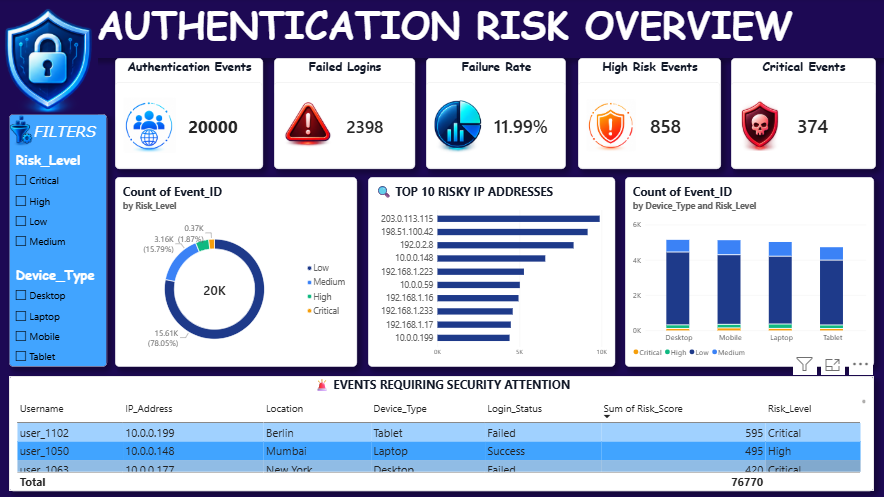

# Cybersecurity Authentication Risk Analytics

## Project Overview

This project analyzes authentication records to identify failed logins and suspicious activity patterns. A rule-based risk scoring approach was developed to classify authentication events into Low, Medium, High, and Critical risk levels.

The project combines data analysis, SQL queries, and interactive visualization to help identify authentication events requiring security attention.

## Objectives

- Analyze authentication records and login activity
- Identify failed login patterns
- Detect suspicious users and IP addresses
- Create a rule-based authentication risk score
- Classify events into Low, Medium, High, and Critical risk levels
- Analyze login patterns across users, IP addresses, devices, locations, and time
- Build an interactive Power BI dashboard for authentication risk monitoring

## Technologies Used

- Excel
- Python
- Pandas
- MySQL
- Power BI

## Project Workflow

### 1. Data Exploration
Initial data inspection and exploration were performed using Excel.

### 2. Data Cleaning and Feature Engineering
Python and Pandas were used to:

- Remove duplicate records
- Handle missing values
- Standardize categorical values
- Convert timestamp data
- Create authentication risk-related features

### 3. Risk Scoring

A rule-based risk scoring system was developed using authentication patterns such as:

- Failed login activity
- User failed login count
- IP failed login count
- Number of users associated with an IP address
- Multiple login locations
- Other suspicious authentication patterns

Events were classified into:

- Low Risk
- Medium Risk
- High Risk
- Critical Risk

### 4. SQL Analysis

MySQL was used to analyze:

- Failed login patterns
- Authentication activity
- User-level patterns
- IP-level patterns
- Device and location-based activity

### 5. Power BI Dashboard

An interactive dashboard was developed to monitor:

- Total authentication events
- Failed logins
- Failure rate
- High-risk events
- Critical events
- Risk distribution
- Risky IP addresses
- Device-based risk patterns
- Events requiring security attention

## Dashboard Preview

## Key Insights

The analysis helps identify authentication events that may require further security investigation by highlighting repeated failures, risky IP activity, and high-risk authentication events.

## Project Files

| File/Folder | Description |
|------------|-------------|
| `images/` | Contains the Power BI dashboard screenshots |
| `Authentication_Risk_Analytics.pbix` | Interactive Power BI dashboard file |
| `cybersecurity_auth_risk_analytics_final.csv` | Final cleaned and enriched authentication dataset |
| `cybersecurity_risk_analysis.ipynb` | Python (Pandas) data cleaning, feature engineering, and risk analysis |
| `cybersecurity_risk_analysis.sql` | MySQL queries for authentication risk analysis |
| `pivot_table_.csv` | Excel pivot table analysis output |
| `README.md` | Project documentation |
